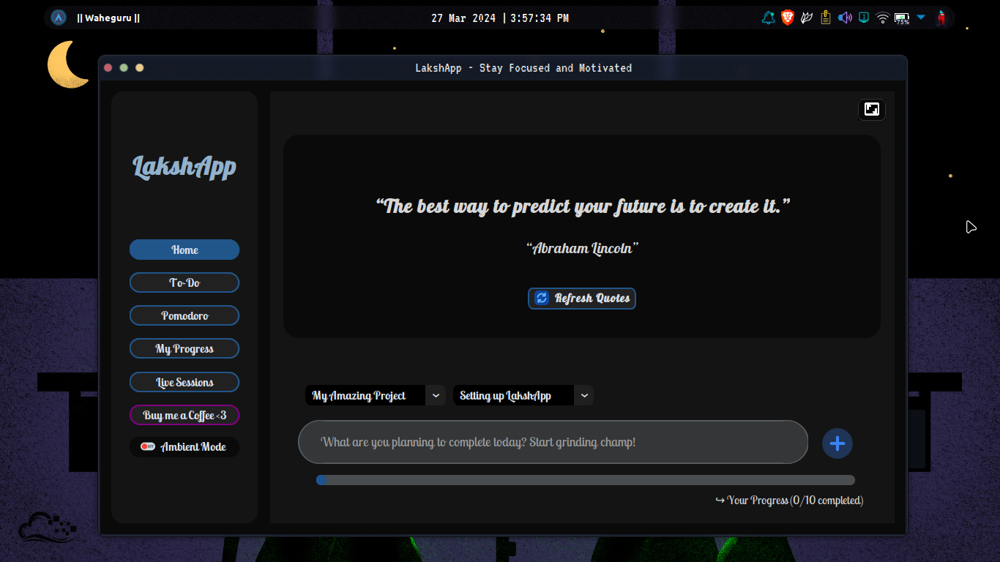
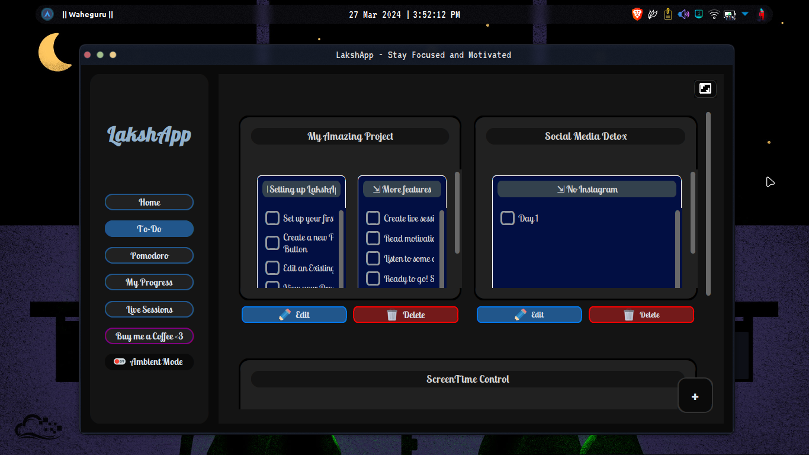
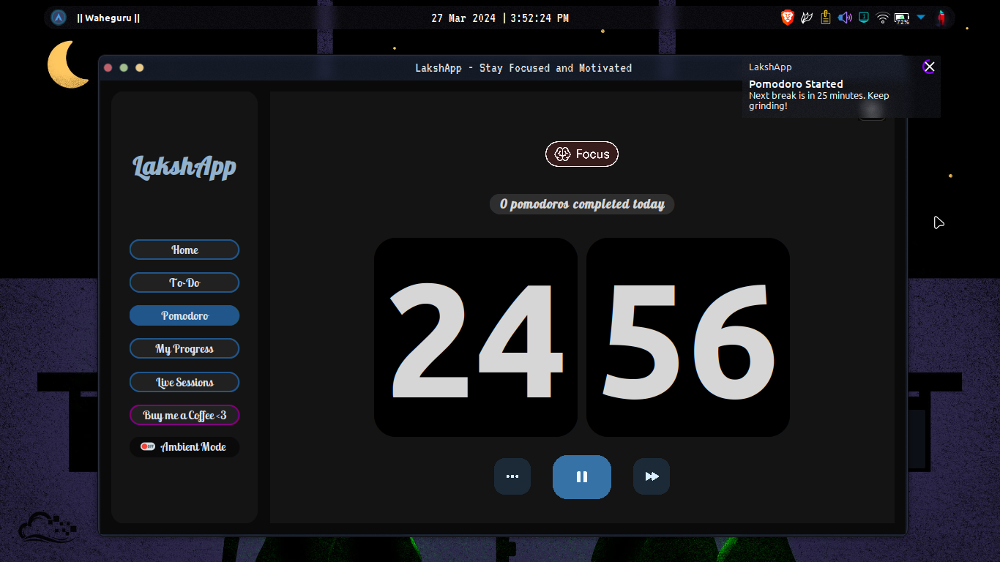

<h1 align="center"><strong>LakshApp</strong></h1>

# LakshApp: Stay Focused and Organized

---

#### LakshApp is a versatile productivity tool designed to help you stay focused, organized, and motivated in your daily tasks and projects. More than just a simple to-do app, LakshApp offers a comprehensive workspace and project management solution to streamline your workflow and boost your productivity.

---

## Screenshots:

### [🏠] Home Page


### [📋] To-Do Page


### [🎁] Pomodoro Page


### [📈] Stats Page


---

## Features:

### [📝] Todo Management:
- Effortlessly manage your tasks and to-dos with LakshApp's intuitive interface. Create, prioritize, and track your tasks with ease, ensuring nothing falls through the cracks.

### [🖥️] Workspace Organization:
- Stay organized with LakshApp's flexible workspace feature. Create custom workspaces to group related tasks and projects together, allowing for better organization and focus.

### [🎓] Project Management:
- Take your project management to the next level with LakshApp's robust project management tools. Break down projects into manageable tasks, assign deadlines, and track progress effortlessly.

### [📅] Calendar Integration:
- Sync your tasks and deadlines with your calendar to stay on top of your schedule. LakshApp seamlessly integrates with popular calendar applications, ensuring you never miss an important deadline again.

### [🤝] Collaboration:
- Collaborate with team members and colleagues on shared projects. Share tasks, assign responsibilities, and communicate effectively within LakshApp's collaborative workspace.

### [💎] Customization:
- Tailor LakshApp to suit your unique workflow and preferences. Customize task lists, project layouts, and workspace settings to create an environment that works best for you.

### [✈️] Cross-Platform Compatibility:
- Access LakshApp from anywhere, anytime, on any device. With support for multiple platforms and devices, including desktop and mobile, you can stay productive on the go.

### [🎶] Ambient Mode:
- Enjoy a relaxing ambiance with soothing music.

---

## Why LakshApp?

As a JEE aspirant, I understand the importance of focus and productivity in achieving academic goals. LakshApp was born out of the need to stay organized, motivated, and relaxed during intense study sessions. By combining essential productivity tools with ambient features, LakshApp aims to provide a holistic solution for students and professionals alike.

---

> ## [📝] Note from developer: 
> Due to recent incidents involving scammers claiming ownership of this project, I've temporarily halted updates to the source code on GitHub. However, LakshApp remains accessible via the Releases page, where users can download it freely and continue to use it as intended. Thank you for your understanding and continued support.

---

## Installation

1. Clone the repository:
    ```sh
    git clone https://github.com/DevInfinix/LakshaAppFocus
    ```
2. Install the required dependencies:
    ```sh
    pip install -r requirements.txt
    ```
    ```py
    # Note that the python installation might fail. It is recommended to install the app via the *Releases* page. Please read the *Note from Developer*!
    ```

---

## Usage

1. Run the application:
    ```sh
    python main.py
    ```
2. Explore the various features of LakshApp.

---

## Contributing

Contributions are welcome! Please fork the repository and submit a pull request.

---

## License

This project is licensed under the Apache License 2.0 - see the [LICENSE](LICENSE) file for details.
