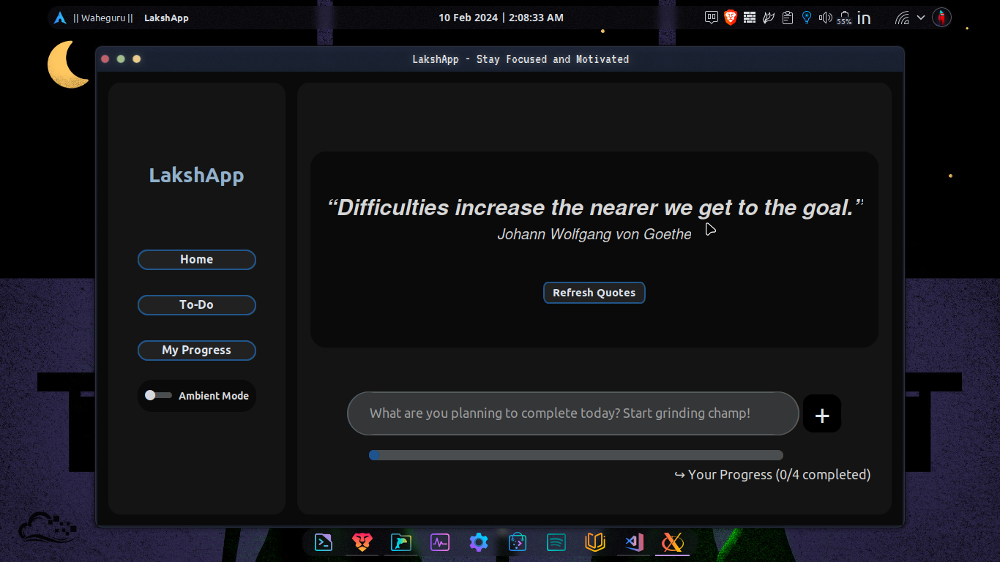
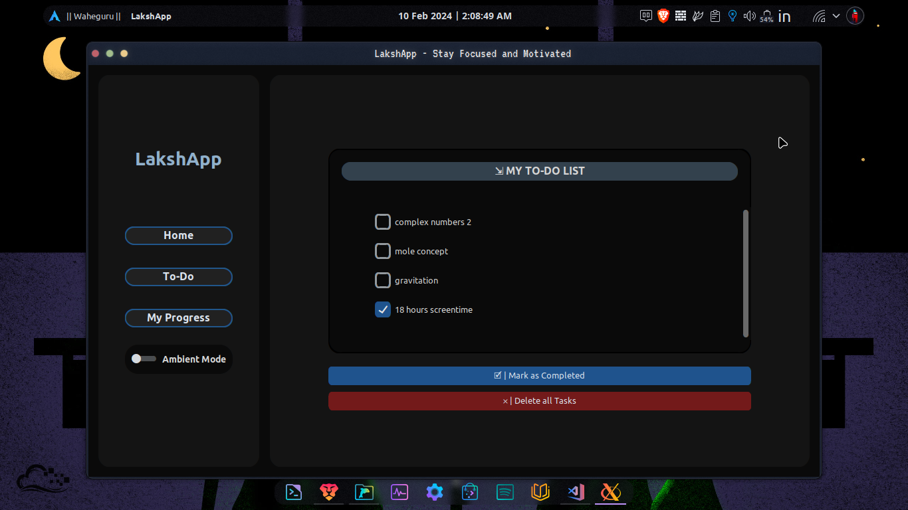
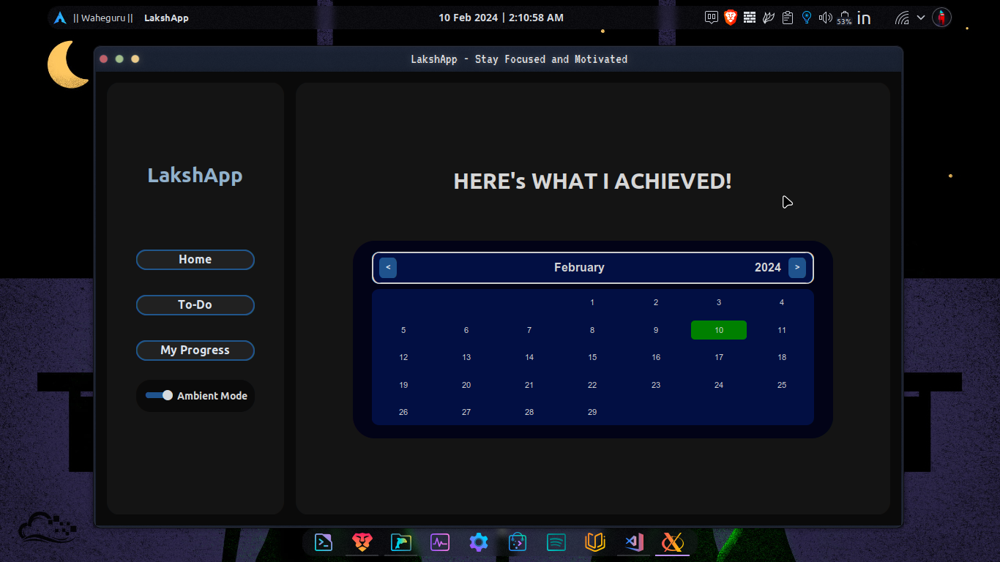

# LakshApp

LakshApp is a Python GUI application developed using the customtkinter library. It offers various features to enhance productivity and relaxation, making it ideal for studying and staying focused. In the future, LakshApp aims to introduce study-specific features to further assist users in their academic endeavors.

---

## Features

### [✨] Motivational Quotes
- Get inspired with daily motivational quotes.

### [📝] To-Do List
- Keep track of your tasks and stay organized with the to-do list feature.

### [📊] Progress Tracking
- View your progress over time and track your achievements.

### [🎶] Ambient Mode
- Enjoy a relaxing ambiance with soothing music.

---

## Screenshots

### [🏠] Home Page


### [📋] To-Do Page


### [📈] Stats Page


---

## Why LakshApp?

As a JEE aspirant, I understand the importance of focus and productivity in achieving academic goals. LakshApp was born out of the need to stay organized, motivated, and relaxed during intense study sessions. By combining essential productivity tools with ambient features, LakshApp aims to provide a holistic solution for students and professionals alike.

---

## Installation

1. Clone the repository:
    ```sh
    git clone https://github.com/DevInfinix/LakshaAppFocus
    ```
2. Install the required dependencies:
    ```sh
    pip install -r requirements.txt
    ```

---

## Usage

1. Run the application:
    ```sh
    python main.py
    ```
2. Explore the various features of LakshApp.

---

## Contributing

Contributions are welcome! Please fork the repository and submit a pull request.

---

## License

This project is licensed under the Apache License 2.0 - see the [LICENSE](LICENSE) file for details.
